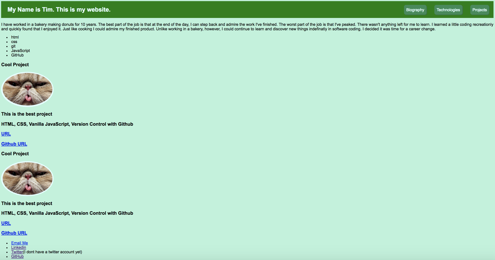

# Personal Bio Site

### About 
*version 0.1*

This is my personal site project.  It is an ongoing project that will be broken up into several segments.  As this project progresses, I will be adding personal touches to make it my own, in adition to showcasing some of my other projects throuout my year at NSS

 

### Provided Instructions
<a href='https://github.com/nss-nightclass-projects/personal-bio-site-instructions/blob/master/personal-bio-site-01.md'>Personal-Bio-Site</a>

 

### How To Use
1. Install `http-server` from `http://www.npmjs.com/package/htt-server`
2. In Terminal, navigate to the project folder and type: `http-server -p 8080`
3. In your browser, navigate to `http://localhost:8080`

 

### Screenshot
